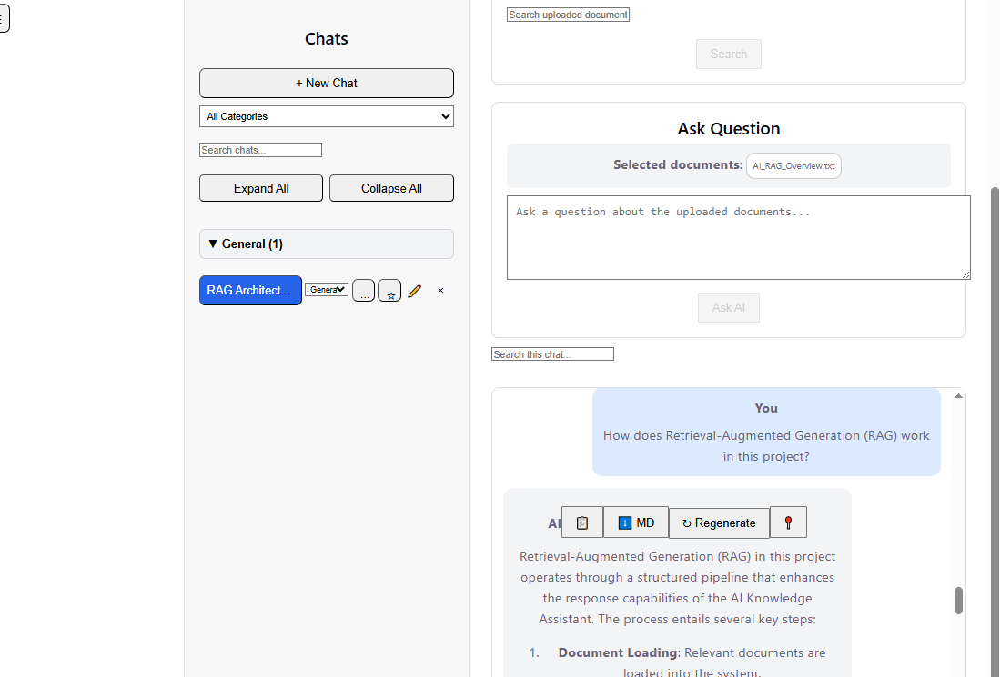
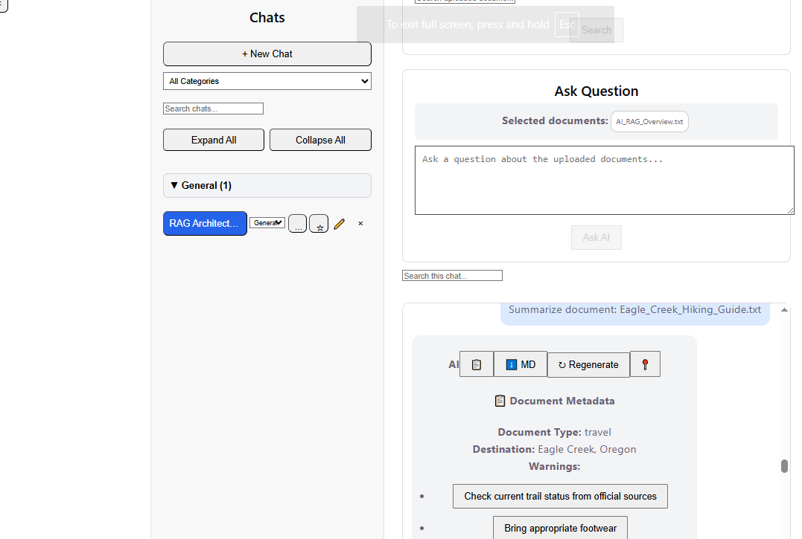
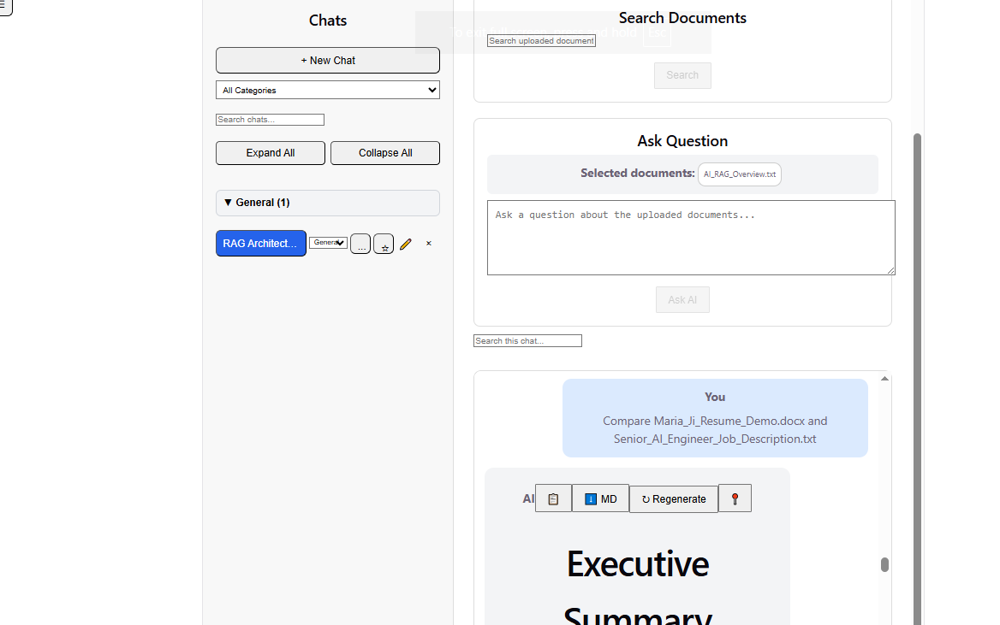
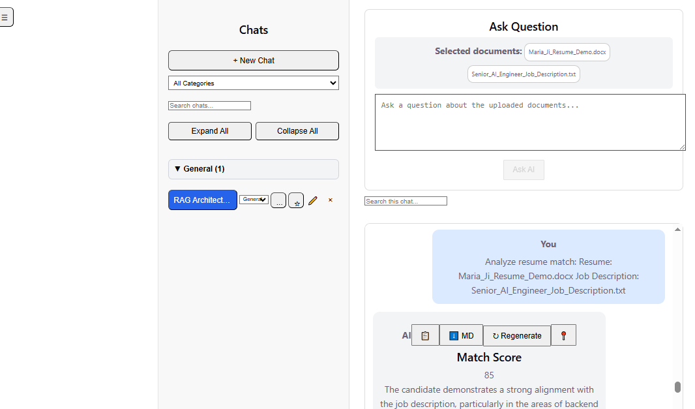
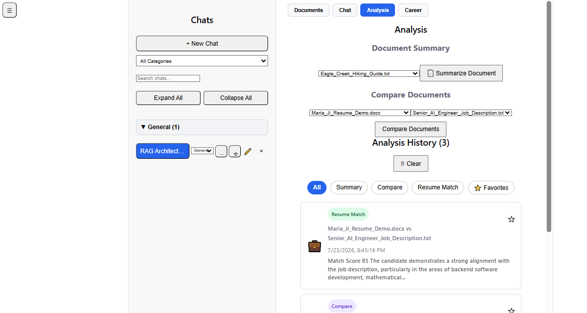

# AI Knowledge Assistant

An AI-powered knowledge assistant that uses Retrieval-Augmented Generation (RAG) to answer questions about uploaded documents, generate AI-powered summaries, compare documents, and analyze resumes against job descriptions.

The application combines modern AI technologies with a production-style full-stack web application to deliver source-grounded answers through an intuitive user interface.

Built with **React**, **FastAPI**, **OpenAI GPT**, and **ChromaDB**.

## Why I Built This

I built this project to gain hands-on experience developing AI applications with Retrieval-Augmented Generation (RAG) and Large Language Models (LLMs).

My goal was to build more than a simple chatbot. I wanted to create a complete full-stack application that combines document retrieval, vector search, AI-powered analysis, and an intuitive user experience. Along the way, I explored techniques such as prompt engineering, embeddings, vector databases, streaming responses, and source-grounded answers.

This project reflects my interest in applying modern AI technologies to solve real-world problems while leveraging my experience in designing and building production software.


## Key Capabilities

### AI Features

- Multi-document AI chat
- Retrieval-Augmented Generation (RAG)
- Source-grounded responses with citations
- Streaming AI responses
- AI-powered document summaries
- AI-powered document comparison
- AI resume-to-job match analysis
- Metadata extraction
- AI-generated document insights
- Suggested follow-up questions

### Productivity Features

- Multiple chat sessions
- Chat history
- Search across chats with match highlighting
- Chat categories
- Collections
- Analysis history
- Favorites
- Export chat as Markdown
- Session management
- Light and dark mode


## Architecture

```
                        +----------------------+
                        |   React Frontend     |
                        +----------+-----------+
                                   |
                                   | REST API
                                   |
                        +----------v-----------+
                        |       FastAPI        |
                        +----------+-----------+
                                   |
                +------------------+------------------+
                |                  |                  |
                |                  |                  |
       +--------v--------+ +-------v-------+ +--------v--------+
       |   OpenAI GPT    | |   Embeddings  | |    ChromaDB     |
       | Response Engine | |   Generation  | | Vector Database |
       +-----------------+ +---------------+ +-----------------+
```

### RAG Workflow

1. Users upload one or more documents.
2. Documents are split into smaller text chunks.
3. OpenAI Embeddings generates vector embeddings for each chunk.
4. Embeddings are stored in ChromaDB.
5. When a user asks a question, the application retrieves the most relevant document chunks.
6. The retrieved context and user question are sent to OpenAI GPT to generate a source-grounded response.
7. The response is streamed back to the user with supporting citations.

### Application Architecture

- **Frontend:** React + Vite
- **Backend:** FastAPI REST API
- **AI Model:** OpenAI GPT
- **Embeddings:** OpenAI Embeddings
- **Vector Database:** ChromaDB
- **Communication:** REST APIs with streaming responses


## Tech Stack

### Frontend

- React
- Vite
- JavaScript (ES6+)
- HTML5
- CSS3

### Backend

- FastAPI
- Python
- REST APIs

### AI Technologies

- OpenAI GPT
- OpenAI Embeddings
- Retrieval-Augmented Generation (RAG)
- ChromaDB (Vector Database)

### Development Tools

- Git
- GitHub


## Screenshots


The following screenshots demonstrate the application's core AI capabilities and user experience.
### Document Management

Upload, organize, and manage documents for AI-powered analysis. Documents can be tagged, categorized, and selected for AI chat, document summaries, comparisons, and resume matching.


---

### AI-Powered Document Q&A

Ask questions about uploaded documents and receive context-aware responses generated from the selected document using Retrieval-Augmented Generation (RAG)



---

### AI Document Summary

Generate structured AI-powered summaries that highlight key information, metadata, and actionable insights from uploaded documents.




---

### AI Document Comparison

Compare two documents with AI to identify similarities, differences, and key insights through a structured comparison, helping users quickly understand relationships between documents.



---

### AI Resume Match Analysis

Analyze a resume against a job description using AI to generate a compatibility score, identify strengths, highlight skill gaps, and provide personalized recommendations.




---

### Analysis History

Review previous AI summaries, document comparisons, and resume match analyses. Filter results by analysis type, mark favorites, and quickly reopen past AI-generated insights.




## Getting Started

### Clone the repository

```bash
git clone  https://github.com/MariaJi/ai-knowledge-assistant.git
```

### Frontend

```bash
cd frontend
npm install
npm run dev
```

### Backend

```bash
cd backend
pip install -r requirements.txt
uvicorn main:app --reload
```


## Future Enhancements

- User authentication
- Multi-user document libraries
- Cloud deployment
- PDF and image OCR support
- Hybrid vector search
- Conversation memory across sessions
- AI agents for document workflows
## About the Project

This project demonstrates how Retrieval-Augmented Generation (RAG), vector databases, and large language models can be combined with modern full-stack web development to build practical AI applications.

The goal was to create an application that is useful, extensible, and demonstrates real-world AI engineering concepts rather than simply integrating an LLM into a web interface.


## Author

**Maria Ji**

Senior Software Engineer with over 10 years of professional experience developing enterprise .NET applications and a Ph.D. in Electrical Engineering.

This project reflects my transition into AI Engineering, combining my software engineering background with modern Generative AI technologies, Retrieval-Augmented Generation (RAG), and full-stack AI application development.

