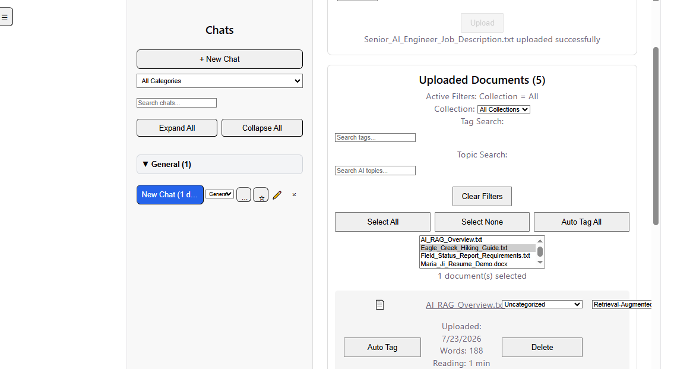

# AI Knowledge Assistant

A full-stack AI Knowledge Assistant that uses Retrieval-Augmented Generation (RAG) to answer questions across uploaded documents, generate AI-powered summaries, compare documents, and analyze resume-to-job matches.

Built with **React**, **FastAPI**, **OpenAI GPT**, and **ChromaDB**.

## Features

### AI Features

- Multi-document chat
- Retrieval-Augmented Generation (RAG)
- Context-aware query rewriting
- AI-generated document summaries
- Resume-to-job match analysis
- AI document comparison
- AI-generated follow-up questions
- Related document discovery
- Metadata extraction
- AI-generated document insights
- Source-grounded answers with citations

### Productivity Features

- Multiple chat sessions
- Chat history
- Chat categories
- Collections
- Search across chats
- Match highlighting
- Previous/Next search navigation
- Analysis history
- Favorites
- Session management
- Export chat as Markdown
- Keyboard shortcuts

## Tech Stack

### Frontend
- React
- JavaScript
- Vite

### Backend
- FastAPI
- Python

### AI Stack
- OpenAI GPT-4o-mini
- OpenAI Embeddings
- ChromaDB

## Architecture

```text
User
  ↓
React Frontend (Vite)
  ↓
FastAPI Backend
  ↓
Question Rewriter
  ↓
OpenAI Embeddings
  ↓
ChromaDB Vector Store
  ↓
GPT-4o-mini
  ↓
Source-Grounded Answer
```

The application uses a Retrieval-Augmented Generation (RAG) pipeline. Documents are chunked, embedded using OpenAI Embeddings, stored in ChromaDB, and retrieved through semantic similarity search. Retrieved context is sent to GPT-4o-mini to generate source-grounded responses.

## Screenshots

### 📂 AI Document Management

Upload documents, organize them into collections, automatically generate AI topics, search by tags and topics, and manage your document library.




### 💬 Multi-Document Chat

Ask questions about one or more uploaded documents using natural language. The assistant retrieves relevant information from the selected documents and generates source-grounded answers.

#### 1. Ask a Question

Select a document and ask a question in natural language.


#### 2. AI Response

The assistant retrieves relevant content from the selected document and generates an accurate, context-aware response instead of relying solely on the language model's built-in knowledge.


#### 3. Search Query & Suggested Questions

Before searching, the assistant automatically rewrites the user's question to improve retrieval quality. It also generates suggested follow-up questions to encourage further exploration.


#### 4. Sources & Citations

Every answer includes the document sources used to generate the response, allowing users to verify where the information came from.


### 📄 Resume Match Analysis

Compare a resume against a job description using AI to evaluate candidate fit, identify strengths and skill gaps, and generate personalized recommendations for improvement and interview preparation.

#### 1. Select Resume and Job Description

Choose a resume and a job description, then start the AI-powered analysis.


#### 2. Match Score & Summary

The assistant analyzes the selected resume against the job description, calculates an overall match score, and provides a concise summary of the candidate's fit for the role.


#### 3. Key Strengths

The assistant highlights the candidate's strengths by identifying relevant skills, experience, and qualifications that closely align with the job requirements.


#### 4. Missing Skills & Resume Improvements

The assistant identifies missing skills and qualifications, then provides actionable recommendations to strengthen the resume and improve its alignment with the selected job description.


#### 5. Interview Questions

Based on the resume and job description, the assistant generates personalized interview questions to help candidates prepare for technical and behavioral interviews.


#### 6. Sources & Citations

Every recommendation is grounded in the uploaded resume and job description. The assistant displays the document sources used during retrieval, allowing users to verify the origin of the analysis.


### Document Comparison
Screenshot coming soon

## Key Challenges Solved

- Built a complete Retrieval-Augmented Generation (RAG) pipeline
- Implemented semantic search using OpenAI embeddings and ChromaDB
- Added conversational query rewriting for better document retrieval
- Generated source-grounded AI responses with citations
- Built AI-powered document summaries, comparisons, and resume matching
- Designed persistent chat sessions and analysis history
- Added metadata extraction and AI-generated document insights
- Implemented search with highlighting across conversations

## What I Learned

This project gave me hands-on experience building a production-style AI application from end to end. Through this project I gained practical experience with:

- Building Retrieval-Augmented Generation (RAG) systems
- Prompt engineering for different document types
- Vector databases (ChromaDB)
- Embedding pipelines with OpenAI Embeddings
- FastAPI backend development
- React frontend development
- Streaming LLM responses
- Semantic search
- AI application architecture
- Building REST APIs for AI workflows
- Integrating LLMs into full-stack applications


## Future Enhancements

- Cloud deployment
- User authentication
- OCR support for scanned documents
- PDF annotation with source highlighting
- Team collaboration
- Advanced RAG evaluation

## Author

Maria Ji
